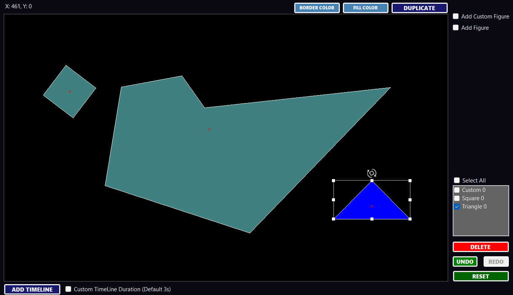
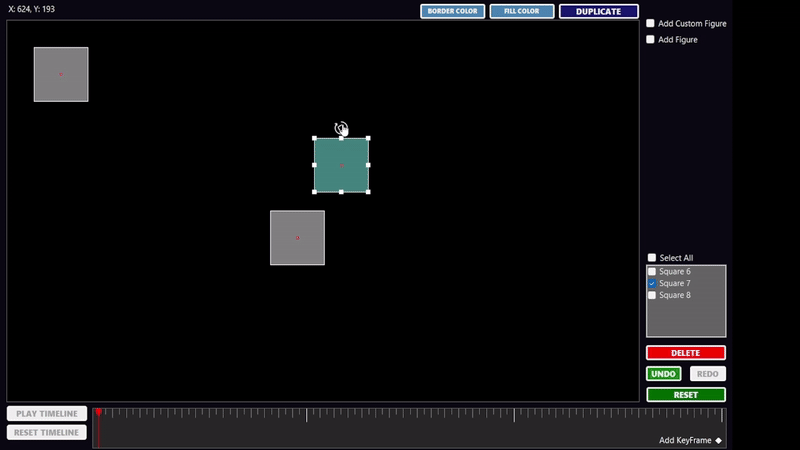

# 2D Graphics Creator and Animator

## Overview
This application is a comprehensive tool for creating and animating custom 2D graphics. Developed using C# and Windows Forms, it offers a wide range of features for manipulating graphical figures such as squares, triangles, and custom shapes. Users can easily translate, rotate, and scale figures to their liking. The program includes keyframe-based animation capabilities, allowing users to capture the state of figures at specific points in time and create animations by interpolating between these states.

## Features
- **Graphical Figure Creation and Manipulation:** Create squares, triangles, and custom shapes. Perform translations, rotations, and scaling operations with ease.
- **Keyframe-Based Animation:** Capture the state of figures at specific times to create smooth animations by interpolating between keyframes.
- **Timeline Interface:** A user-friendly timeline allows for the addition, deletion, and rearrangement of keyframes. It also provides visual feedback, displaying the current frame, keyframes, and the playhead.
- **Color Customization:** Change fill and border colors to customize your figures and animations.
- **Advanced Editing Tools:** Select multiple figures, duplicate them, and leverage reset, undo, and redo capabilities for flexible editing.
- **Animation Playback:** Play back your created animations directly within the application to see your work come to life.

## Usage
Here's a glimpse of what you can create with the 2D Graphics Creator and Animator; watch this quick animation to see the application in action:

